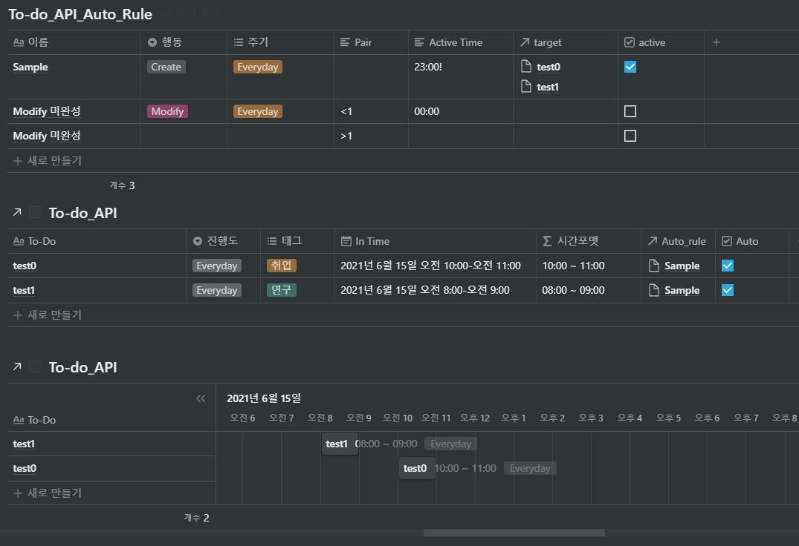

# Notion API를 이용한 Daily To-do Auto Create, Modify Program

제공되는 템플릿 To-do Page에서 사용자가 테이블에 직접 등록한 룰에 따라, To-do 블럭이 자동으로 생성되고, 자동으로 수정되는 프로그램.

Template : [https://www.notion.so/ewooooo/To-Do-ver-Notion-API-11e680fd6727404bbbe5a30d9ff53037](https://www.notion.so/ewooooo/To-Do-ver-Notion-API-11e680fd6727404bbbe5a30d9ff53037)

---

## Notion_Auto_To-do.py

- 같은 디렉토리에 'mydata' 파일(테이블 및 유저 토큰 데이터) 필요
- OS 스케줄을 이용하여 주기적으로 실행 시켜야 함.

## mydata

- 첫줄 : To-do_API_Auto_Rule 테이블 ID

- 둘째줄 : To-do_API 테이블 ID

- 셋째줄 : $NOTION_API_KEY
    ```
    ************************************                        # To-do_API_Auto_Rule table id
    ************************************                        # To-do_API table id
    ********************************************************    # NOTION_API_KEY
    ```
- 테이블(db) ID 확인법

    ```python
    https://www.notion.so/myworkspace/a8aec43384f447ed84390e8e42c2e089?v=...
                                      |--------- Database ID --------|
    ```

    참고 : [https://developers.notion.com/docs](https://developers.notion.com/docs)

---

# Rule 사용법

Template Auto rule : [https://www.notion.so/ewooooo/To-do_API_Auto-1fbcb6e01661490aa7954dc991943e21](https://www.notion.so/ewooooo/To-do_API_Auto-1fbcb6e01661490aa7954dc991943e21)



### Table 정의

- To-do_API : To-do 일정을 담고 있는 일반적인 테이블
- To-do_API_Auto_Rule : 자동 생성, 자동 수정 룰을 담고 있는 테이블(룰 테이블)

### 기능 공통 To-do_API_Auto_Rule 테이블 속성 정의

- '이름' (타이틀) : 룰 이름으로 임의 지정하면 됨
- '행동' (선택) : Create(자동 생성), Modify(자동 수정) 기능 지정
- '주기' (다중 선택) : 자동 생성(수정)이 반복적으로 이루어지는 사이클, 중복 선택 가능함, Everyday 선택 시 다른 값보다 우선순위를 가지고 매일 작동함
- 'Active Time' (텍스트) : 자동 생성(수정)이 실행되는 시간으로 23:00으로 입력할 시 오후 11시에 생성(수정) 작업이 실행됨
    - 규칙 __ : __ 5글자 모두 적어야함 (07 : 00)
    - 시간 뒤에 !를 붙이면 자동 생성 기능에서 생성 In Time 날짜가 다음날로 지정됨(기능1. 에서 설명)
- 'target' (관계형) : To-do_API 테이블과 관계형으로 연결된 속성으로 룰에 대한 타겟(세부내용)을 연결됨.(기능에서 설명.)
- 'active' (체크박스) : 룰 활성화 조건, 체크 해제 시 룰이 작동하지 않음
- 'Pair' (텍스트) : 미완성

### 기능 1. 자동 생성 (Create)

- 자동 생성기능으로 룰 테이블(To-do_API_Auto_Rule)에 기재된 주기와 시간(Active Time)에 따라 'target'(관계형) 속성으로 연결된 To-do 테이블(To-do_API) 컬럼의 속성들을 복제하여 생성함.
- 생성 시 'In Time' 속성의 날짜와 시간 데이터는 시간정보는 유지한채 날짜 정보만 생성하는 날짜로 변경됨.

    (ex: 현재날짜 2021.06.15일때, 'In Time' [2021.06.11 13:00~14:00]인 데이터로 생성하면  'In Time' [2021.06.15 13:00~14:00]이 생성됨) 

    추가 사항 :  'Active Time' (텍스트) 시간 뒤에 !를 붙이면 생성하는 날짜를 하루 뒤로 설정하여 생성.

    (ex: 현재날짜 2021.06.15일때, 'Active Time'[ 23:00! ] 이고, 'In Time' [2021.06.11 13:00~14:00]인 데이터로 생성하면  'In Time' [2021.06.16 13:00~14:00]이 생성됨) 

- 나머지 속성은 모두 그대로 복제 생성됨.(단, Rule 관련 속성('Auto_rule' , 'Auto' )은 지워짐

### 기능2. 자동 수정(Modify)_미완성
- 미완성

### 코드 종속적 테이블 속성(dependency)

- To-do_API 테이블

    Date(type:날짜) , Auto(체크박스)는 타입을 변경하면 안되며, 속성 이름 변경 시 코드의 아래 부분 수정 필요.

    ```python
    InTime_attribute_name = 'In Time'
    Auto_attribute_name = 'Auto'
    ```

- To-do_API_Auto 테이블

    행동(선택), 주기(다중 선택), Pair(텍스트), Active Time(텍스트), target(관계형), active(체크박스)는 타입을 변경하면 안되며, 속성 이름 변경 시 코드의 아래 부분 수정 필요.

    ```python
    action_attribute_name = '행동'
    cycle_attribute_name = '주기'
    pair_attribute_name = 'Pair'
    active_time_attribute_name = 'Active Time'
    relation_attribute_name = 'target'
    active_attribute_name = 'active'
    ```

---

